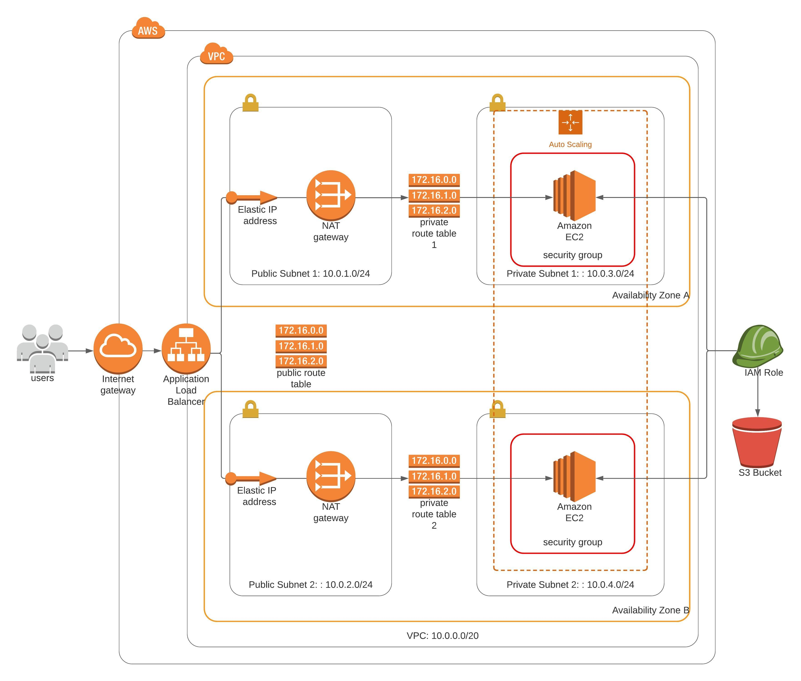

# Deploy a high-availability web app using CloudFormation

## Architecture Overview
The following diagram shows the infrastructure setup of this project.



## Introduction

In this project, we will deploy web servers for a highly available web app using CloudFormation. We will write the code that creates and deploys the infrastructure and application for an Instagram-like app from the ground up. We will begin with deploying the networking components, followed by servers, security roles and software. After the basic structure of network and servers are set up, we have additionally also set a cloudwatch alarm for notifying us when the total error rate exceeds 1. We have set up a SNS service to receive email in the scenario of this alarm getting triggered.

### Files included:

- infra_architecture.jpeg - infrastructure diagram
- network.yaml - CloudFormation network infrastructure stack description.
- network-parameters.json - Parameters file for the network infrastructure stack
- udagram.yaml - CloudFormation services infrastructure stack description
- udagram-parameters.json.json - Parameters file for the services infrastructure stack
- network-script.sh - bash script for managing network infrastructure stack
- server-script.sh - bash script for managing services infrastructure stack

### Running the project:

1. Execute network infrastructure stack.
    ```
    network-script.sh create
    ```

2. After seccessful completion of step 1, execute services infrastructure stack.
    ```
    server-script.sh create
    ```

### Output
Services stack outputs the final website URL.

## Website link

The project is available at: http://websit-WebAp-sOSJbesz5u16-1216062866.us-east-1.elb.amazonaws.com